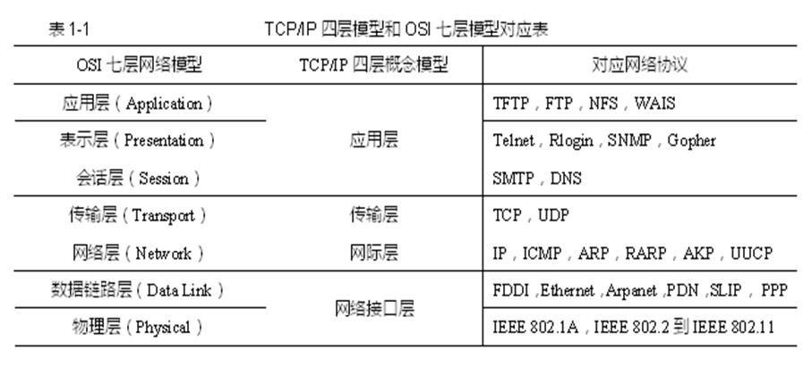
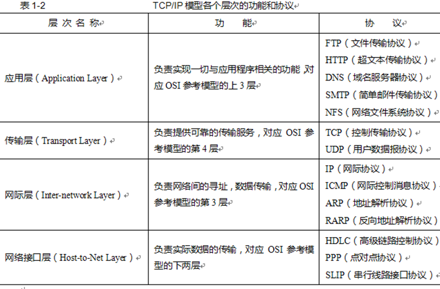

# 网络模型

计算机网络是指由通信线路互相连接的许多自主工作的计算机构成的集合体，各个部件之间以何种规则进行通信，就是网络模型研究的问题。
网络模型一般是指OSI七层参考模型和TCP/IP四层参考模型。这两个模型在网络中应用最为广泛。

## OSI七层模型

1. 物理层(Physical Layer)
1. 数据链路层(Data-Link Layer)
1. 网络层(Network Layer)
1. 传输层(Transport Layer)
1. 会话层(Session Layer)
1. 表示层(Presentation Layer)
1. 应用层(Application Layer)

其中低三层即物理层、数据链路层和网络层用于实现通信子网中的信息传输，或者说它们是面向通信的（一般称之为通信子网），
最高三层即会话层、表示层和应用层是向应用进程提供资源子网功能的服务，因此他们是面向应用的，
中间层即传输层，它是在高三层和低三层之间起桥梁作用。

### 物理层

物理层是建立在通讯介质的基础上实现系统和通讯介质的接口功能，为数据链路实体之间透明的传输比特流提供服务。

物理层的功能：
- 物理链接的建立和拆除（通信前建立链接，通信结束拆除链接）
- 物理服务数据单元传输（数据的发送和接收）
- 物理层管理（管理本层的某些事务如功能的激活、差错控制等）

### 数据链路层

数据链路层的主要用途是在相邻两系统的网络实体之间建立、维持和释放数据链路链接，以及正确无误的传输数据链路服务数据单元。

数据链路层功能：
- 数据链路连接的建立和释放
- 数据链路协议数据单元的形成
- 定界和同步
- 顺序和流量控制
- 差错检测和恢复

### 网络层

网络层主要涉及通信子网和主机的接口，网络层提供建立、维持和释放网络连接的手段，以实现两个端系统中传输实体间的通信。

- 网络层的功能
    - 网络连接服务
    - 路径选择（两个网络地址之间选择一条适当的传输路径）
    - 网络连接多路复用
    - 分段与组段
    - 有序传输和流量控制
    - 差错的检测和恢复

- 网络层提供的数据传输服务
    - 数据报服务（收、发双方无需建立连接）
    - 虚电路服务（通信双方之间建立一条虚电路进行通信）

### 传输层

传输层在低三层和高三层间起桥梁作用，该层消除了 OSI 高层所要求的服务与各类网络层所提供的服务之间的差异，具体表现在以下三方面：

1. 传输出错率和建立连接的失败率（传输层应针对不同的网络服务再增加相应的服务使之满足高层的要求）
1. 数据传输速率、吞吐量和传输时延（如果通信子网所提供的这几项指标不能满足上层要求，传输层应增加相应措施改善这些指标）
1. 分段和组段功能（网络层所传输的数据单元大小是一定的，但会话层数据单元大小是任意的，传输层应具有分段和组段的功能，通过对会话层数据单元进行分段、组段来构成适合在网络连接上传送的数据单元）

### 会话层

会话层的作用是对基本的传输连接服务进行“增值”，以提供一个能满足多方面要求的会话连接服务。

会话层的功能：
- 半双工通信
- 更有效的差错纠正机制
- 允许暂停发送消息

### 表示层

表示层主要用途是对不同系统的表示方法进行转换，消除网内各应用实体之间的语言差异以实现不同系统之间的数据交换。

表现层功能：
- 协商各种传送语法以实现传送语法和本地语法的交换
- 数据加密
- 数据压缩

### 应用层

应用层为应用进程访问 OSI 环境提供了手段，并直接为应用进程服务。

应用层所提供的服务：
- 公共应用服务元素（提供应用层中最基本的服务）
- 特定应用服务元素（为特定需要提供服务如文件传送、虚拟终端等）

## TCP/IP四层模型

1. 网络访问层/网络接口层
1. 网络互连层/网际层
1. 传输层
1. 应用层

### 网络访问层 

在源主机系统，网络访问层接收由网络互连层送下来的IP数据报，并对它做一些处理后，将它发送给选定的网络，再将它传送给目标主机。目标主机系统的网络访问层接收由目标主机物理层向上传送的IP数据包，经处理后，再向上是那个给网络互连层。

网络访问层关注的是两个端系统之间的数据通信，以及两个端系统借以通信的网络类型。

### 网络互连层

网络互连层是 TCP/IP 模型中最重要的层次，其中的IP协议主要用于异构型网络之间的相互连接和路由选择。

IP 所提供的是面向无连接的、不可靠的传输服务，它可使由源主机发送的IP数据包穿越由各种WAN和不同LAN互连形成的互连网络，到达目标主机。

### 传输层

传输层中最主要的协议是传输控制协议TCP，它所提供的是面向连接的、可靠的端到端的通信机制。TCP协议是建立再网络层的基础上的，在制定TCP时，已考虑到它所依赖的通信子网可能是不可靠的，因此，TCP协议张采取了增强可靠性的措施以确保传输层能正确无误地运行。
UDP也是属于传输层的协议，UDP是一种无连接、不可靠的协议。

### 应用层

应用层提供了许多用于支持各种应用程序的网络服务，相应地，在应用层有许多应用层协议，如FTP,SMTP,TELNET,SNMP,HTTP,DNS等

## 对比

## Reference

- <https://github.com/WeihanLi/TechNotes/issues/14>
- 《计算机操作系统》-- 西安电子科技大学出版社